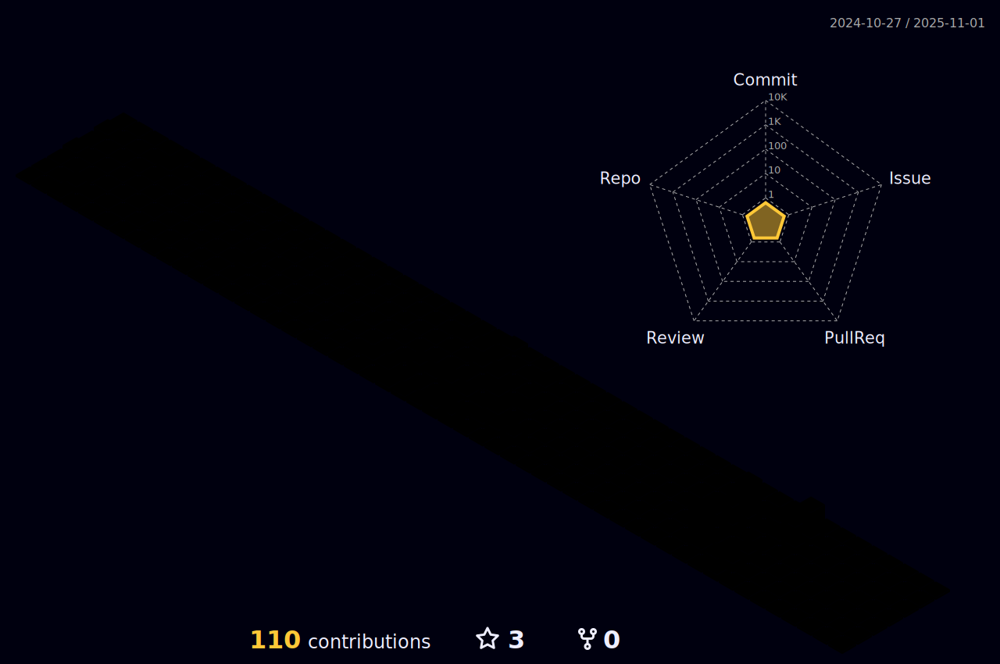

# 💫 About Me:
3 years experience in DevOps and Cloud, passionate about automating IT processes, enthusiastic designing and building effective Continuous Integration and Delivery (CI/CD) pipelines using containerization, orchestration, monitoring, infrastructure automation tools, configuration management tools, and cloud solutions. 

## 🌐 Socials:
 

# 💻 Tech Stack:
                          
# 📊 GitHub Stats:
 
 

## 🏆 GitHub Trophies

### 🔝 Top Contributed Repo

<!-- Proudly created with GPRM ( https://gprm.itsvg.in ) -->

